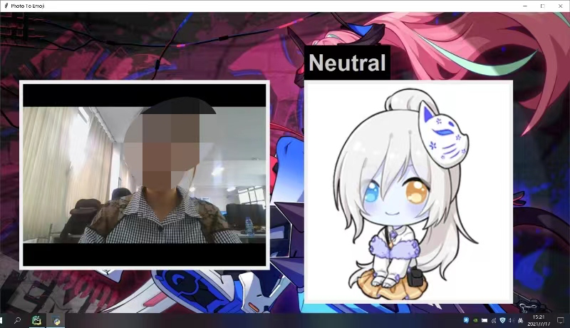
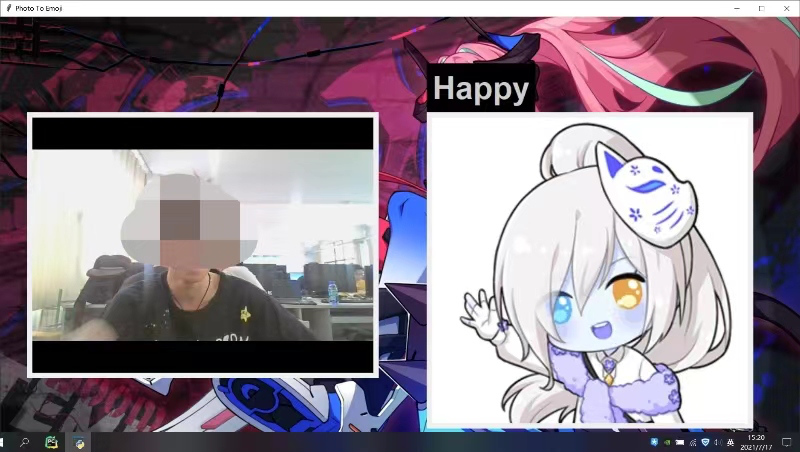

# ExpressionRecognition

对人类面部表情进行分类，以过滤和映射相应的表情符号或头像。用户通过摄像头实时上传自己的表情；系统对用户的表情进行分析；经过对比之后输出相应的识别标签。

Human facial expressions are classified to filter and map the corresponding emoji or avatar. The user uploads his expression in real time through the camera; the system analyzes the user's expression; and outputs the corresponding identification label after comparison.

能够识别，以下类别的面部情绪组成：

Able to recognize, the following categories of facial emotion composition:

0：生气 Angry
1：厌恶 Disgusted
2：恐惧 Fearful
3：快乐 Happy
4：自然 Neutral
5：悲伤 Sad
6：惊喜 Surprised

##### tool

cuda10.0，python3.7，tensorflow，Keras，opencv-python，tkinter

##### Data Set

FER2013 dateset

##### example

